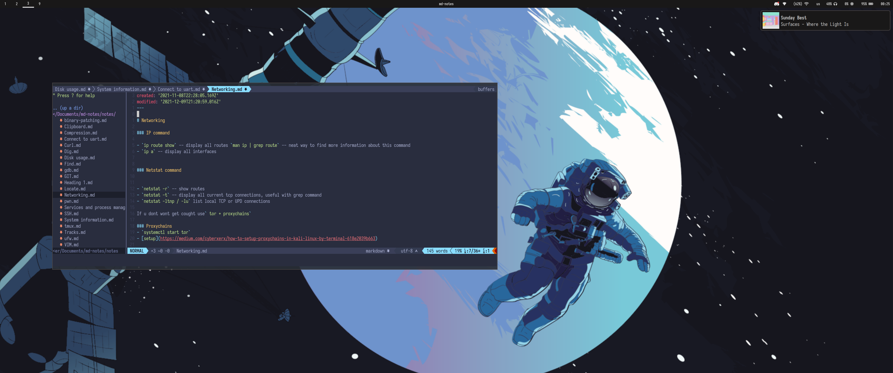

### dots-fresh
Collection of my dotfiles. Do not just run this script without reading what it does!
## Usage
```bash
Usage: sudo install.sh [-option]
Options:
    --help    Print this message
    -i        Install base packages (sudo perms needed)
    -s        Instal sec packages
    -d        Install dev packages
    -a        Apply dots
```
## Screenshot

